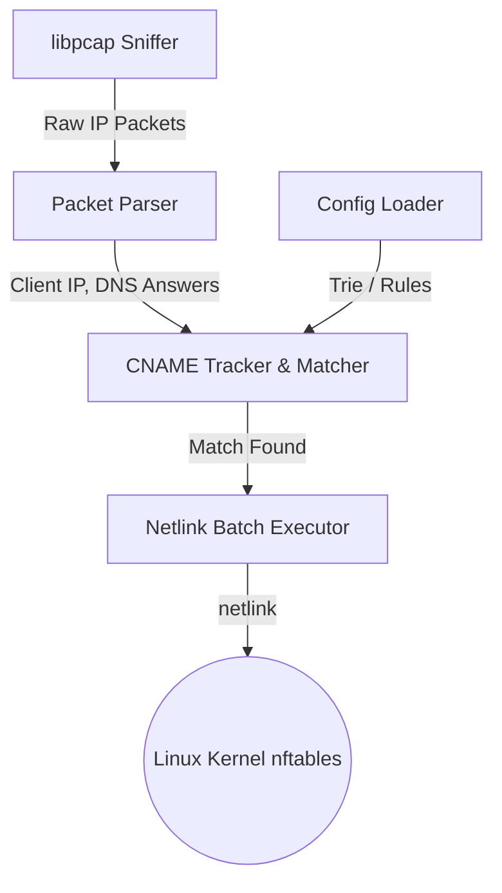

# dns-nftsetter

A Linux tool written in Rust that sniffs DNS traffic, parses resolved IPv4 addresses from A and CNAME records, and dynamically updates nftables sets based on user-configured rules.

## Context and Purpose

The goal is to implement a client-specific and domain-specific routing/policy rule addition mechanism on a NixOS / Linux router:

1. **Sniff DNS Responses**: Listen on specified network interfaces (or all) for UDP DNS response packets (source port 53).
2. **Match Source & Domain**: Compare the source IP of the query (destination IP of the response packet) and the resolved domain (including subdomain wildcard matching, e.g., `apple.com` matches `apple.com` and `*.apple.com`) against the configurations.
3. **Parse Records**: Supports IPv4 `A` and `CNAME` records. Resolves CNAME chains using a bounded-size CNAME cache to track the original query domain for the resolved IP.
4. **Update nftables Sets**: Direct Netlink socket communication to execute `add element` commands with the DNS record's TTL as the timeout.
   - For specific IP rules (e.g., `192.168.0.100/...`) or wildcard rules (`* /...`): Elements are added as `src_ip . resolved_ip` into a pair set (`type ipv4_addr . ipv4_addr`).
   - For global wildcard rules (`*!/...`): Elements are added as `resolved_ip` into a single IP set (`type ipv4_addr`).

## Build and Run Environment

- **Target System**: Linux / NixOS.
- **Build toolchain**: Managed via `shell.nix` which installs Rust, Cargo, `pkg-config`, and `libpcap`.
- **Packet Sniffing**: Uses `libpcap` to capture DNS traffic on UDP port 53 with low overhead and kernel-level BPF filtering (`udp src port 53`).
- **nftables Integration**: Communicates directly with the Linux kernel Netlink socket to avoid spawning command-line processes or depending on external libraries.

## Architecture

